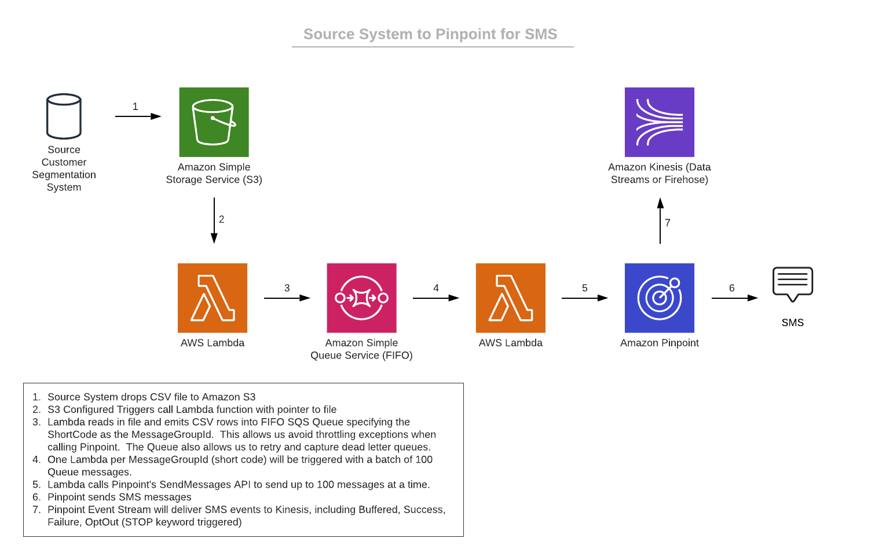

# Processing SMS Sends through Amazon Pinpoint using an Amazon S3 File Drop

## Description
Amazon Pinpoint's SendMessages API can be used to send both Transactional and Promotional SMS messages.  This repository shows how to use a CSV file drop in Amazon S3 to trigger a send via Amazon Pinpoint.

Many times, third party tools can be used to generate a targeted list of users for an SMS campaign.  By dropping a file into S3, we can trigger the SMS messages to go out within milliseconds.  

This solution takes advantages of an Amazon SQS FIFO Queue to ensure that we are able to control the concurrency of AWS Lambda functions being invoked as to not cause throttling exceptions.  If using SMS Long Codes, it might be smart to include a Sleep(xxx) as long codes are limited to 1 per second.  Short codes have a default rate limit of 100 per second.

This solution is written in Python and uses a CloudFormation Template.

This solution expects a CSV file as per the [example file](sample_file.csv).  If making changes, please review both Lambda functions.

Prereqs:
* Name of a unique Amazon S3 Bucket
* Amazon Pinpoint Project setup
* A short or long code provisioned in Amazon Pinpoint

[CFN Template](template.yaml)

